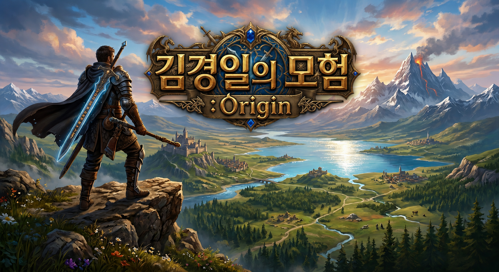
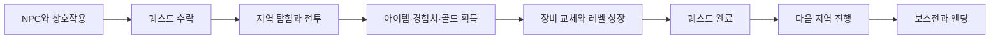
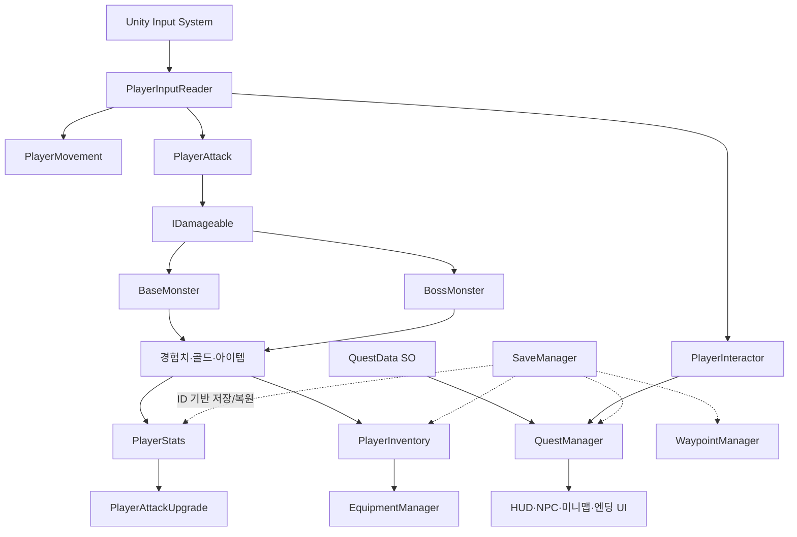

# 김경일의 모험 : Origin

**퀘스트, 전투, 성장, 탐험을 하나의 흐름으로 구현한 3D 쿼터뷰 액션 RPG**

## 프로젝트 소개

`김경일의 모험 : Origin`은 천호마을에 닥친 위기의 원인을 추적하며 여러 지역을 탐험하는 3D 액션 RPG입니다. 플레이어는 NPC에게 퀘스트를 받고, 몬스터와 전투해 장비와 경험치를 획득하며, 캐릭터를 성장시켜 최종 보스가 기다리는 왕의 무덤까지 나아갑니다.

단순한 전투 데모에 머무르지 않고 **퀘스트 → 전투 → 보상 → 성장 → 다음 지역 해금 → 보스전 → 엔딩**으로 이어지는 완결된 플레이 흐름을 만드는 것을 목표로 개발했습니다.

| 항목 | 내용 |
| --- | --- |
| 장르 | 3D 쿼터뷰 액션 RPG |
| 개발 기간 | 2026.05.19 ~ 2026.06.08 (3주) |
| 개발 형태 | 1인 개발 |
| 플랫폼 | Windows |
| 엔진 | Unity 6.3 (`6000.3.15f1`) |
| 주요 지역 | 천호마을, 마력의 황무지, 어둠 숲, 오크 주둔지, 왕의 무덤 |

## 게임 플레이 흐름

## 주요 구현 내용

| 기능 | 핵심 구현 | 기술 포인트 |
| --- | --- | --- |
| **전투와 성장** | 선입력 가능한 3단 콤보와 레벨별 공격 강화 | Animation Event, `OverlapBoxNonAlloc`, `IDamageable`, Hit Stop |
| **몬스터와 보스 AI** | 배회·감지·추격·공격 AI, 체력 50% 이하 보스 2페이즈 | NavMeshAgent, MonsterData ScriptableObject, 거리 기반 패턴 선택 |
| **퀘스트** | 선행 퀘스트부터 엔딩까지 이어지는 상태 기반 진행 | QuestData ScriptableObject, C# 이벤트, 미니맵 목표 안내 |
| **상호작용과 장비** | NPC·상인·상자·웨이포인트 통합 상호작용, 장비 능력치·모델 교체 | `IInteractable`, 최근접 대상 탐색, ItemData ScriptableObject |
| **세이브와 웨이포인트** | 플레이어·장비·퀘스트·해금 지점 등 전체 진행도 복원 | 고유 ID Registry, JSON, AES 암호화·HMAC 무결성 검사 |
| **사운드와 라이팅** | 지역 이동에 맞춘 BGM 및 환경 분위기 전환 | BGM 크로스페이드, Zone 우선순위, URP Volume·Fog 블렌딩 |

## 시스템 구조

## 기술 스택

| 구분 | 기술 | 활용 내용 |
| --- | --- | --- |
| Engine / Language | Unity 6.3.15f1, C# | 게임 로직, 물리, 애니메이션 |
| Rendering / Camera | URP 17.3.0, Cinemachine 2.10.7 | 구역별 연출과 쿼터뷰 카메라 |
| Input / AI | Input System 1.19.0, AI Navigation 2.0.12 | 입력 통합과 NavMesh AI |
| UI / Audio | uGUI, TextMeshPro, AudioMixer | HUD·인벤토리·퀘스트·사운드 |
| Data / Save | ScriptableObject, JSON | 데이터 분리와 진행도 저장 |
| Version Control | Git, GitHub | 버전 및 개발 기록 관리 |

## 조작 방법

| 키 | 기능 |
| --- | --- |
| 방향키 | 이동 |
| `Space` | 공격 / 콤보 입력 |
| `Left Shift` | 대시 |
| `F` | NPC·상점·상자·웨이포인트 상호작용 |
| `S` | 회복 아이템 사용 |
| `Tab` | 인벤토리 열기/닫기 |
| 마우스 휠 | 카메라 줌 |
| `Esc` | 옵션 / 일시 정지 |

## 실행 링크

STOVE
https://store.onstove.com/ko/games/104971

### Unity Editor에서 실행

1. Unity Hub에서 Unity `6000.3.15f1` 버전으로 프로젝트를 엽니다.
2. `Assets/Scenes/MainTitle.unity` 씬을 열고 Play합니다.

## 개선 방향

- 몬스터와 보스 패턴을 State/Strategy 구조로 분리해 전투 다양성과 확장성 강화
- 저장 데이터 수집·암호화·복원 책임을 분리해 `SaveManager`의 복잡도 개선
- 인벤토리와 상점의 거래 규칙을 UI에서 분리해 유지보수성 향상

## 관련 문서

- [프로젝트 진행 기록](./PROJECT_PROGRESS.md)
- [핵심 구현 내용](./Docs/핵심_구현_내용.html)
- [보스 몬스터 구현 기록](./Docs/보스몬스터_구현_핸드오프.md)
- [최종 빌드 노트](./Docs/최종%20빌드%20노트/김경일의%20모험%20Origin%20최종%20빌드%20노트.md)

---

이 저장소는 게임 개발 포트폴리오와 구현 기록을 목적으로 공개되어 있습니다.
